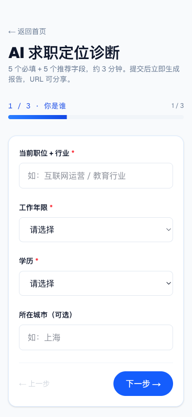
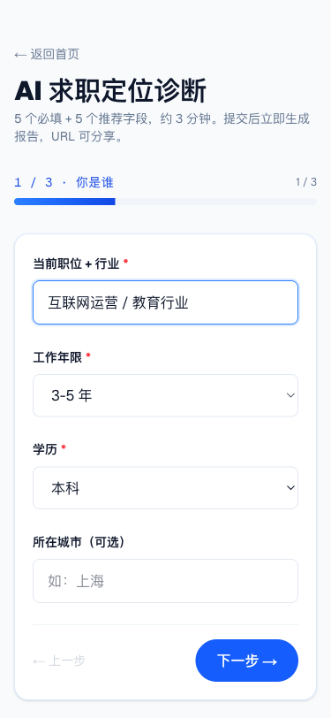
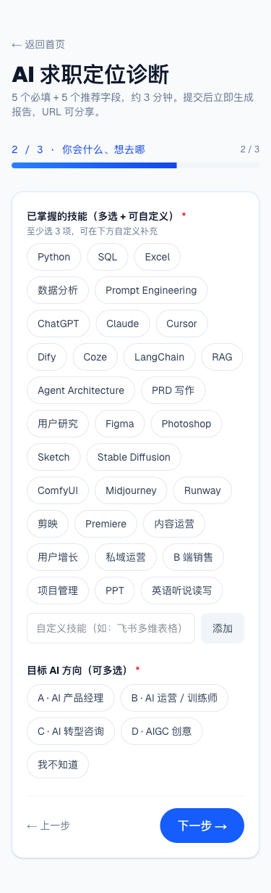
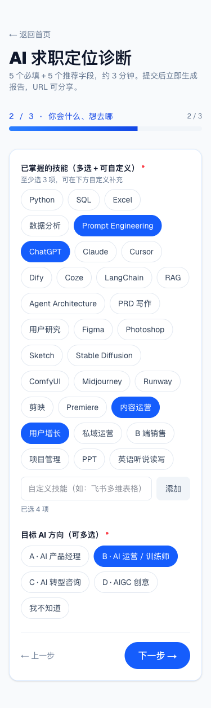
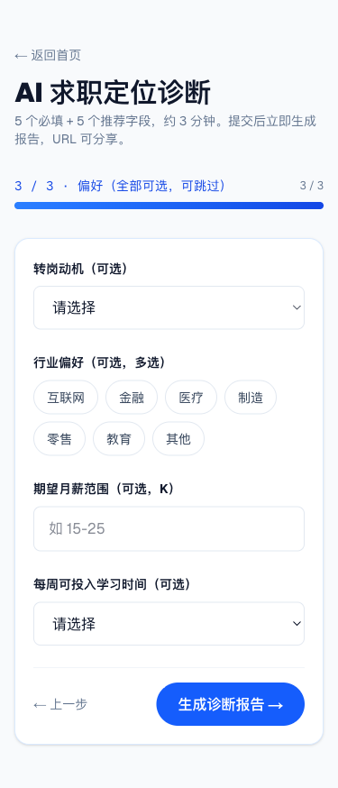
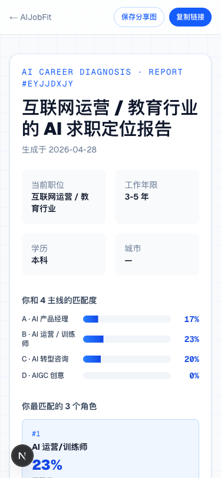
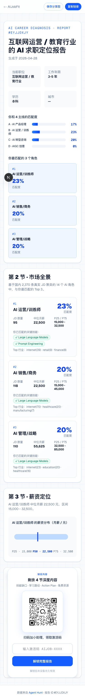
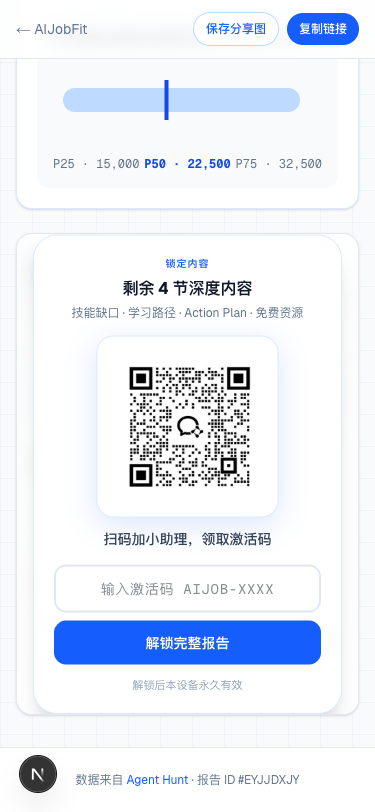

# AIJobFit 用户流程 · 图文版

> **给运营 + 业务同学**：这份文档让你 5 分钟就把"用户在手机微信里到底看到什么、点什么、怎么走完这条漏斗"过一遍。所有截图都是 375px 移动端尺寸，和用户在微信 WebView 里看到的一致。
>
> 配套阅读：[`产品手册-运营版.md`](./产品手册-运营版.md)（话术 / FAQ / 异常场景处理）。本文档只讲"用户屏幕上发生了什么"，不重复 FAQ。
>
> **本文档以路线 A（帮我定位）的 14 张截图为主线**。路线 B（目标 Gap 诊断）末尾有简述节，截图待业务上手后补。

**线上地址**：<https://aijobfit.llmxfactor.cloud>

---

## 漏斗一图速览

```
微信生态（朋友圈/群/1V1）
   │   分享卡片或链接
   ▼
① 首页 Hero（双 CTA + 4 主线总览）
   │
   ├─【路线 A】点"帮我定位"      → /diagnose         系统推 Top 3
   └─【路线 B】点"我有目标..."   → /diagnose-target   用户锁定行业 + 岗位
                                               │
                                               ▼
                                        ② 多步表单（路线 A 路线 B 字段不同）
                                               │
                                               ▼
                                        ③ 报告页（前 3 节开放）
                                               · 路线 A：4 主线分布 + Top 3 + whyMatched
                                               · 路线 B：锁定目标 + 综合匹配度 + whyMatched
                                               │ 滚到下方
                                               ▼
                                        ④ 软遮罩 + 小助理 QR  ◀───  你（运营）的接触点
                                               │ 长按 QR 加好友
                                               ▼
                                        ⑤ 你发激活码 AIJOB-2026
                                               │ 用户回报告页输码
                                               ▼
                                        ⑥ 解锁后 4 节（Gap / 路径 / Action / 资源）
                                          · 路径 + Action 按 audience 切应届/社招文案
                                               │
                                               ▼
                                        ⑦ 报告底部 CTA：换路线 / 重选目标（带预填）
```

整个旅程预计：**用户填表 3 分钟 + 看前 3 节 1 分钟 + 加你微信 + 等回复 + 解锁看后 4 节 5-10 分钟 ≈ 10-15 分钟**。

---

## ① 首页 Hero — 用户的第一印象


**重点**：
- 标题"给非程序员的 AI 求职定位诊断"是定位的核心 — 看到这句话用户秒懂"这不是给程序员的"
- **首屏现在有两个并列 CTA**（截图为单 CTA 旧版，已升级到双 CTA）：
  - 「**帮我定位 →**」蓝底白字（路线 A，主推）— 适合"我不知道做什么 AI 岗位"
  - 「**我有目标，诊断匹配度 →**」白底蓝边（路线 B）— 适合"我已经想好做 XX，看自己差多少"
- 底部 4 个数据锚点（**2,370 / 14 / 4 / 10 min**）建立可信度
- Hero 下方有 **"4 条 AI 转型主线" 总览卡**（A/B/C/D 各自的关键技能、适合人群、JD 数、中位月薪）— 让用户在动手填表前就懂主线
- 副标题三行写清"运营/设计/HR/营销/咨询/传统行业转 AI · 不卖课 不催单"

**你的话术钩子**：写内容时反复强调"基于 2370 条真实 JD"和"非程序员"两个标签。**路线 A 是默认推荐**，路线 B 留给已经有清晰目标的用户。

---

## ② 表单 Step 1 — 你是谁（5 必填中的 3 个）



**字段**：当前职位+行业 / 工作年限 / 学历 / 城市（可选）

**字段填好后的状态**：



**重点**：
- 进度条 **1/3** 在顶部，让用户知道还有多远
- "下一步"按钮在所有必填项填完后才会变蓝（变成可点击）
- 城市可选 — 不强迫填
- **工作年限分支已升级**（截图未反映）：现在是 `在读学生 / 应届生（无实习）/ 应届生（有实习）/ 1-3 年 / 3-5 年 / 5-10 年 / 10+ 年`。应届生 = 一等受众，报告里的学习路径和 7/30/90 天 Action 会自动切到校招/实习语境

---

## ③ 表单 Step 2 — 你会什么、想去哪（核心数据采集）

进度条变 **2/3**。这一步决定了报告 70% 的内容。



**字段**：
- **已掌握的技能**（多选，至少 3 项）— 31 个候选 + 自定义补充框
- **目标 AI 方向**（多选）— A AI 产品经理 / B AI 运营/训练师 / C AI 转型咨询 / D AIGC 创意 / 我不知道
  - 字段下方有 **"4 条主线分别是什么？"折叠面板**（截图未反映）— 点开能看每条主线的关键技能 / 适合人群 / JD 数 / 中位月薪。让用户不再盲选

填好后选中态变深蓝填充：



**用户常见困惑（你要会答）**：
- "我会的技能不在列表里" → 用下方"自定义技能"输入框补，比如"飞书多维表格"、"剪映商业版"
- "我不确定自己想去哪条主线" → 选"我不知道"，算法会用 4 主线均权计算

---

## ④ 表单 Step 3 — 偏好（全部可选）



**字段**：转岗动机 / 行业偏好 / 期望月薪 / 每周可投入学习时间

**重点**：
- 这一页所有字段都写了"（可选）"或"（可选，多选）" — 用户可以全跳直接点"生成诊断报告"
- "转岗动机" 里有个选项叫 "**35 岁危机**" — 这个选项本身是漏斗里的种子（35 岁焦虑用户匹配的内容会有针对性）
- 这一页提交后立即跳到报告页（**无 loading，URL 即报告**）

---

## ⑤ 报告页封面（前 3 节开放区）

提交后报告秒出。顶部是一张包含基础信息和 4 主线匹配度的封面：



**封面结构（路线 A）**：
- 报告 ID（如 `#EYJJDXJY`）和生成日期
- 4 个用户基本信息卡片
- **4 主线匹配度**横条图（A/B/C/D 各占多少 %）
- **Top 3 角色**（带 #1 #2 #3 排名）

**第 2 节（市场全景）和第 3 节（薪资定位）紧跟其后**。第 2 节里每个 Top 3 角色卡片下方有 **"为什么是你？"段落**（截图未反映）— 列出技能命中数、targetTrack 加权、行业匹配/偏移、0 命中诚实声明等推理链。让用户看清"系统为什么推这个角色"，不是黑盒。

前 3 节完整全页长这样（高斯模糊看得见但读不清的就是后 4 节）：



**用户视角**：信息满满但读到一半被遮罩挡住，触发"想看完"的心理。

---

## ⑥ 软门槛遮罩 + 小助理 QR（漏斗的关键转化点）

滚到底部就是这个：



**这一屏要传达的 4 件事**：
1. **"剩余 4 节深度内容"** — 告诉用户还有什么
2. **"技能缺口 · 学习路径 · Action Plan · 免费资源"** — 具体讲剩下这 4 节是干嘛的
3. **小助理 QR** — 长按可识别（微信 WebView 自动支持）
4. **激活码输入框 + 解锁按钮** — 给已经有码的人留入口

**关键操作（你要懂）**：
- 用户在微信里**长按 QR 图片** → 微信弹出"识别图中二维码"菜单 → 跳到加好友确认页
- 用户加好友请求 → 你通过 → **你需要回复激活码 `AIJOB-2026`**（详细话术见运营手册"场景 1"）
- 用户回报告页 → 输入激活码 → 看到后 4 节

---

## ⑦ 用户输入激活码

用户从你这拿到 `AIJOB-2026` 复制回去，输入框看起来是这样：


**容错说明（用户可能问）**：
- **大小写不敏感**：输 `aijob-2026` 也行
- **前后空格自动 trim**：复制粘贴带空格也没事
- **解锁后本设备永久有效**（写在按钮下方）— 同一台手机/电脑下次打开同一份报告不需要再输码
- **换设备需要重新输码**（激活码同一个，长期不变）

---

## ⑧ 解锁后的后 4 节

输完点"解锁完整报告"，遮罩瞬间消失，后 4 节平滑出现。

### 第 4 节 · 技能 Gap 分析


**这一节告诉用户**：
- "已掌握 X / 10 项 required 技能"（用大数字给冲击）
- 已掌握的技能用绿色 ✅
- 主要 Gap 用红色 ❌，按 JD 出现频次倒序，每个 Gap 标"**先补 / 后补 / 优选**"优先级

**用户常见反应**："原来我离这个角色就差这几样"

### 第 5 节 · 3 种学习路径


**3 条路径完整呈现**：
- **路径 A · 自学（免费）** — 3 个月学习路线 + 通用资源 + 主线专项资源（带链接，用户可点）
- **路径 B · 3800 就业班** — 12 周陪跑细节 + 不承诺包就业 + 90 天后公开 Cohort Report
- **路径 C · 1V1（999+，规划中）** — 标注"规划中"，建议先选 A 或 B

**自学路径下方有黄色警示卡**：


> ⚠️ 自学风险：80% 自学者中途放弃；缺反馈循环、孤单。如果你属于"自己很难逼自己"那一类，可以看路径 B。

**这是诚实推免费资源 + 同时给商业化路径留口子的设计**。

### 第 6 节 · 7 / 30 / 90 天行动


**3 个时间盒**：
- 未来 7 天 — 用 Cursor / 加学习社群（启动级）
- 未来 30 天 — 完成 Datawhale 一期 / 搭一个能跑的 Agent
- 未来 90 天 — GitHub 项目 / 重新做诊断对比 Gap

**重新做诊断**这个动作是产品的留存钩子 — 90 天后用户回来再走一遍就能看到自己进步。

**应届生用户的差异**：上面的 7/30/90 天 Action 文案对应届会自动切换 — d7 加 AI 校招/实习社群，d30 投出第一份实习/校招简历，d90 拿 1 段实习经验或 1 个能演示项目，路径 A/B 副标题也变成"应届校招前的黄金窗口"和"应届秋招/春招冲刺最佳节奏"。这部分截图未反映，但现实流量里大约会看到。

### 第 7 节 · 报告生成依据

末节是数据透明度声明：基于 2370 条 JD / 14 角色聚类 / 算法说明 / 数据更新日期 / 不出售用户数据承诺。

**用户质疑结论时**，把他指到第 7 节，让他看数据来源。

### 报告底部 · 换路线 CTA（解锁后才看到完整版）

报告页 LockedSections 之后还有一个**互推 CTA section**（截图未反映）：

- **路线 A 报告底部**：「这 3 个推荐都不是你想要的？切到目标 Gap 诊断 →」点了跳 `/diagnose-target?from=<hash>`，已填字段全自动带过去
- **路线 B 报告底部**：「觉得这个目标不太对？」+ 两个按钮：「重选目标 →」（同流程换岗位）、「让系统推荐 Top 3 →」（切到路线 A）

让用户在两条路线之间几乎零摩擦切换，避免"做完一份觉得不对劲就走人"。

---

## 路线 B 简述（截图待补，原理同上）

路线 B = "目标 Gap 诊断"，给已经有明确求职目标的用户。流程比路线 A 多一步**锁定目标**：

```
首页 → 点"我有目标，诊断匹配度" → /diagnose-target
  Step 1 · 锁定你的目标
    · 目标行业（互联网 / 金融 / 医疗 / 制造 / 零售 / 教育 / 其他，单选 chip）
    · 目标岗位（从 14 个真实 JD 聚类的角色中下拉选 1 个，按 JD 数排序）
  Step 2 · 你的背景与技能
    · 工作年限 / 在校状态、学历、当前职位、城市、技能（≥3 项）
    · 顶部展示"已锁目标：[行业] · [岗位]" banner
  Step 3 · 偏好（可跳）
    · 转岗动机、期望月薪、每周学习时间
  ↓
报告页（路线 B 版）
  · 第 1 节封面：替换 "4 主线分布 + Top 3" 为 "锁定目标 · 综合匹配度 X%" 大卡
  · 第 2 节：标题改 "你的目标匹配度"，只有 1 个角色卡（不是 Top 3），含 whyMatched
  · 后面节（薪资 / Gap / 路径 / Action / 资源）逻辑围绕锁定角色展开
  · 底部双 CTA "重选目标" + "让系统推荐 Top 3"
```

**适合什么用户**：
- 已经有明确目标（"我就想做 AI PM" / "我就想做 AIGC 视频"）
- 想看"这个具体目标我差多少 + 行业适配度"

**不适合什么用户**：
- 完全不知道自己适合做什么（应该走路线 A）
- 想看"AI 行业全景"（路线 A 有 4 主线分布 + Top 3 视角）

**业务实操注意**：
- 路线 B 用户进来的预设是"我已经做了功课"，所以**别在话术里劝他改目标**，让产品的报告自己讲话
- 如果他匹配度很低，**让他点报告底部"让系统推荐 Top 3" CTA 自己看路线 A 视角**，比你劝有效
- 0 命中场景路线 B 不会有黄色 banner（因为用户已锁定 = 自己负责），只在角色卡 whyMatched 里诚实声明 "0 项命中"，**这是设计内的诚实，别替系统道歉**

---

## 微信生态特有行为（PC 浏览器看不到的）

### A. 长按 QR 自动识别
用户在微信 WebView 里**长按小助理 QR 图片** → 微信弹"识别图中二维码"菜单 → 一步加好友。这是微信的原生能力，不需要扫码。

### B. "复制链接" 在微信里降级显示
报告页顶部有"复制链接"按钮。在微信 WebView 里它会**降级为提示文字**："点右上角 ··· 复制链接"。原因：微信 WebView 屏蔽了 navigator.clipboard API，只能引导用户走微信原生的菜单。

### C. 分享卡片
用户把报告链接发到聊天/朋友圈时，微信会自动抓取 OG 图：
- **聊天卡片**（800×800 方形）— 自动展示 Top 1 角色 + 匹配度 + 薪资
- **朋友圈卡片**（横版 1200×630）— 同上

OG 图是动态生成的，每个用户的分享卡片不一样。

### D. "保存分享图" 1080×1920 海报
报告页右上角"保存分享图"按钮 — 生成竖版海报（适合发朋友圈截图）。海报底部有 QR 直接指向首页（不是你的小助理 QR）— 是为了让海报在朋友圈传播时能引来更多新用户。

---

## 运营动作清单（基于上面这条流程）

| 流程节点 | 用户动作 | 你的动作 |
|---|---|---|
| ①-④ | 看首页 → 填表 → 提交 | 不接触 |
| ⑤ | 看前 3 节报告 | 不接触 |
| ⑥ | 长按 QR 加好友 | **接到加好友请求 → 通过** |
| ⑥-⑦ | 等你回复 | **发欢迎语 + 激活码（见运营手册场景 1）** |
| ⑦ | 输入激活码解锁 | 等用户消化 5-10 分钟 |
| ⑧ | 看完后 4 节 | **发第二条：问 Top 1 角色是什么、感兴趣哪条路径** |
| 后续 | 用户回应或沉默 | **按回应分流（社群 / 1V1 / 不主动催）** |

具体话术 / 激活码错输处理 / 0 匹配度用户怎么答 / 用户问"是不是要付费" → 全在 [`产品手册-运营版.md`](./产品手册-运营版.md) 里。

---

## 上线前自测清单

发内容引流之前，你应该能不假思索答出：

- [ ] 激活码是什么？答：`AIJOB-2026`，大小写不敏感
- [ ] 用户加你之后第一句话怎么说？答：见运营手册场景 1 模板
- [ ] 用户匹配度 0% 怎么办？答：见运营手册场景 4
- [ ] 用户问"是不是要付钱"？答：永久免费，激活码只是加微信的触点
- [ ] 用户长按 QR 没反应？答：让他升级微信版本，或者直接发链接 + 激活码给他
- [ ] 用户在微信里点"复制链接" 没反应？答：让他点屏幕右上角 ··· 菜单，里面有"复制链接"
- [ ] 用户问数据从哪来？答：开源项目 Agent Hunt，2370 条真实 JD，链接在报告第 7 节末
- [ ] 路线 A 和路线 B 啥区别？答：A 是系统推 Top 3 角色（用户没目标），B 是用户锁定行业 + 岗位算匹配率（用户有目标）。两个互推都自动带预填，用户来回切换无成本
- [ ] 应届生流量怎么处理？答：表单工作年限有 3 个应届分支；报告 7/30/90 天 Action 自动切到校招/实习语境；话术上重点推免费自学（路径 A）+ 鼓励先做 1 个能演示的项目，别推 1V1（999+）

---

## 常用资源链接

- 生产：<https://aijobfit.llmxfactor.cloud>
- 运营手册：[`产品手册-运营版.md`](./产品手册-运营版.md)
- 数据来源：<https://github.com/LLM-X-Factorer/agent-hunt>
- 一份示例报告（可拿来给同事演示）：<https://aijobfit.llmxfactor.cloud/result/eyJjdXJyZW50Sm9iIjoi5LqS6IGU572R6L-Q6JClIC8g5pWZ6IKy6KGM5LiaIiwieWVhcnNFeHAiOiIzLTUg5bm0IiwiZWR1Y2F0aW9uIjoi5pys56eRIiwic2tpbGxzIjpbIlByb21wdCBFbmdpbmVlcmluZyIsIkNoYXRHUFQiLCLlhoXlrrnov5DokKUiLCLnlKjmiLflop7plb8iXSwidGFyZ2V0VHJhY2siOlsiQiDCtyBBSSDov5DokKUgLyDorq3nu4PluIgiXSwibW90aXZhdGlvbiI6IjM1IOWygeWNseacuiIsImluZHVzdHJ5IjpbIuaVmeiCsiJdLCJ0aW1lQnVkZ2V0IjoiMTAtMjAg5bCP5pe2In0>
