# AIJobFit 用户流程 · 图文版

> **给运营 + 业务同学**：这份文档让你 5 分钟把"用户在手机微信里到底看到什么、点什么、怎么走完这条漏斗"过一遍。所有截图都是 375px 移动端尺寸，2026-05-01 当天用 Playwright 拍自本地 v0.4.0 dev 实例。
>
> 配套阅读：[`产品手册-运营版.md`](./产品手册-运营版.md)（话术 / FAQ / 异常场景处理）。本文档只讲"用户屏幕上发生了什么"，不重复 FAQ。
>
> **当前版本**：v0.4.0（GEO 二期 ship · 2026-05-01）。三路线 A/B/C + 5 主线（含 E 留行）+ 主线指纹扫描 + 行业切片 + HowTo schema + `/skills` 35×14 技能热力图 + RSS feed + 9 篇 blog。

**线上地址**：<https://aijobfit.llmxfactor.cloud>

---

## 漏斗一图速览（v0.4.0）

```
微信生态（朋友圈/群/1V1）  +  搜索 / AI 答案引擎（GEO 矩阵约 228 SSG 页面）
   │   分享卡片 / SEO 落地页 / blog / 技能热力图
   ▼
① 首页 Hero（B+C 双主 CTA + A 兜底链接）+ 5 主线总览 + 卖点 + Blog 入口 + FAQ × 8
   │
   ├─【B 转行】点"我想转行做 AI 角色"   → /diagnose-target     用户锁定行业 + 14 角色
   ├─【C 留行】点"我留在原行业 + 加 AI 技能" → /diagnose-augment   用户填原职业（free-text）
   └─【A 兜底】"两个都不确定"           → /diagnose            系统推 Top 3
                                               │
                                               ▼
                                        ② 多步表单（A/B/C 字段不同，3 步进度条）
                                               │
                                               ▼
                                        ③ 报告页（前 3 节开放）
                                               · 路线 A：4 主线分布 + 主线指纹 + Top 3 + whyMatched
                                               · 路线 B：锁定目标 + 综合匹配度 + 角色卡 whyMatched
                                               · 路线 C：原职业 + AI 增强 + readiness banner + Route C Overview
                                               · Salary 加 industry slice + 期望薪资达成率 + 城市 tier 对照
                                               · 应届时 cover/roles/salary 注入校招 vs 社招 对照
                                               │ 滚到下方
                                               ▼
                                        ④ 软遮罩 + 小助理 QR + 激活码输入  ◀── 你（运营）的接触点
                                               │ 长按 QR 加好友
                                               ▼
                                        ⑤ 你发激活码 AIJOB-2026
                                               │ 用户回报告页输码
                                               ▼
                                        ⑥ 解锁后 4 节（Gap / 路径 / Action / 资源）
                                          · 路径 + Action 按 audience 切应届/社招文案
                                               │
                                               ▼
                                        ⑦ 报告底部 CTA：三路线互通（带预填）
                                          · A 报告底 → B + C
                                          · B 报告底 → 重选目标 + C + A
                                          · C 报告底 → B + A
```

整个旅程预计：**用户填表 3 分钟 + 看前 3 节 1 分钟 + 加你微信 + 等回复 + 解锁看后 4 节 5-10 分钟 ≈ 10-15 分钟**。

---

## ① 首页 — 用户的第一印象

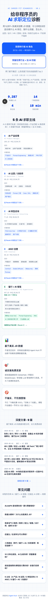

**v0.4.0 首页结构（自上而下）**：

1. **Hero 区**
   - 蓝色小字 `AI Career Fit Diagnosis · v0.1`（前缀标识）
   - 主标题"给非程序员的 **AI 求职定位**诊断"
   - 副标题强调 "{jdAll}+ 条真实招聘 JD 数据 · 10 分钟告诉你适合做什么 AI 岗位 / 缺什么技能 / 怎么补"
   - 行业列表："运营 / 设计 / HR / 营销 / 咨询 / 传统行业转 AI · 不卖课不催单"
   - **双主 CTA 卡片**（关键）：
     - 蓝实心卡 `我想转行做 AI 角色` → /diagnose-target（B）
     - 白底蓝边卡 `我留在原行业 + 加 AI 技能` → /diagnose-augment（C）
   - **A 兜底文字链**：`两个都不确定？让系统基于你的技能推荐 Top 3` → /diagnose
   - 下面一行解释："转行 vs 留行的差别：转行算『你能不能上 AI 产品经理』；留行算『电气工程师 + AI 技能』这个画像在国内有多少 JD"
   - 4 个数据锚点（runtime 数）：`{jdAll} 条真实 JD / {rolesTotal} 角色聚类 / 4 主线 / 10 min`

2. **5 条 AI 求职主线总览**（TrackOverviewServer 渲染）
   - A AI 产品经理 / B AI 运营 / C AI 转型咨询 / D AIGC 创意（4 张蓝色卡）+ E 留行 + AI 增强（emerald 视觉差异）
   - 每张卡：JD 数 / 中位月薪 / keySkills 标签 / 适合人群 / 直达 CTA（A-D 进 /diagnose、E 进 /diagnose-augment）

3. **3 个卖点**：📊 基于真实 JD 数据 / 🎯 诚实推免费资源 / 🚫 不催买不饥饿营销

4. **深度文章入口**（Blog · 9 篇）—— 4 张最新文章卡片 + "查看全部 9 篇 →" 链接

5. **常见问题 FAQ × 8**（折叠面板 + FAQPage JSON-LD，让 Google / Perplexity / ChatGPT 能直接引用）—— 覆盖：付费？数据来源？非程序员能转吗？应届生能用吗？三路线选哪个？10 分钟出报告靠谱吗？是不是卖课？5 主线区别？

6. **Footer**：runtime 数 `{jdLabeled} 已聚类 / {jdAll} 总 JD / {rolesTotal} 角色聚类`

**你的话术钩子**：写引流文案时反复强调"基于真实 JD 数据"和"非程序员"两个标签。**B+C 是双主推**，A 是兜底；不要把 A 写成默认推荐。Blog 文章和 5 主线卡可以在小红书/公众号/朋友圈直接挂链接，每张卡都能通向漏斗。

---

## ② 表单 Step 1 · 路线 A（系统推荐 Top 3）

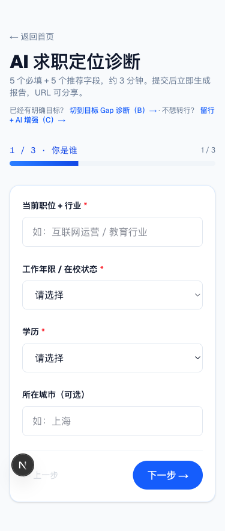

**路径**：首页 A 兜底链接 → /diagnose

**头部**：返回首页 / 标题"AI 求职定位诊断" / 副标题"5 个必填 + 5 个推荐字段，约 3 分钟" / **跨路线引导**："已经有明确目标？切到目标 Gap 诊断（B）→ · 不想转行？留行 + AI 增强（C）→"

**Step 1 / 3 · 你是谁** 字段：
- 当前职位 + 行业 *（必填，文本输入）
- 工作年限 / 在校状态 *（下拉，应届分支：在读学生 / 应届无实习 / 应届有实习 / 1-3 年 / 3-5 年 / 5-10 年 / 10+ 年）
- 学历 *（下拉）
- 所在城市（可选）

**进度条** `1 / 3 · 你是谁` 在表单顶部。下一步按钮在必填项填齐前 disabled。Step 2 是技能 + 目标方向，Step 3 是偏好（动机 / 期望薪资 / 时间）。

---

## ③ 表单 Step 1 · 路线 B（转行 Gap 诊断）

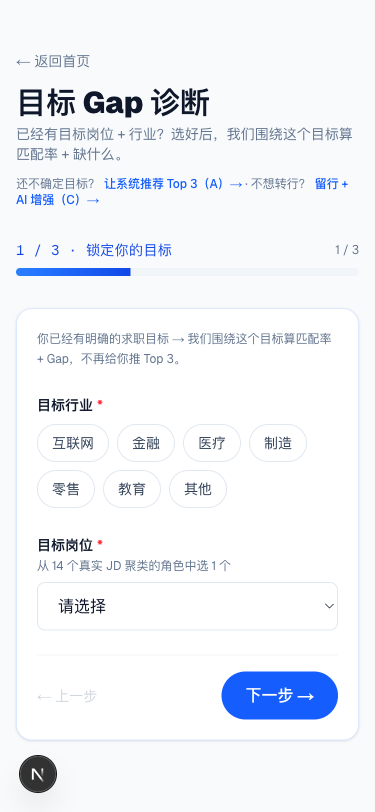

**路径**：首页 B 主 CTA → /diagnose-target

**头部**：标题"目标 Gap 诊断" / 副标题"已经有目标岗位 + 行业？选好后，我们围绕这个目标算匹配率 + 缺什么" / **跨路线引导**："还不确定目标？让系统推荐 Top 3（A）→ · 不想转行？留行 + AI 增强（C）→"

**Step 1 / 3 · 锁定你的目标** 字段：
- 顶部说明卡："你已经有明确的求职目标 → 我们围绕这个目标算匹配率 + Gap，不再给你推 Top 3。"
- 目标行业 *（chip 单选：互联网 / 金融 / 医疗 / 制造 / 零售 / 教育 / 其他）
- 目标岗位 *（下拉，从 14 个真实 JD 聚类的角色按 JD 数排序选 1）

Step 2/3 同 A。

---

## ④ 表单 Step 1 · 路线 C（留行 + AI 增强）

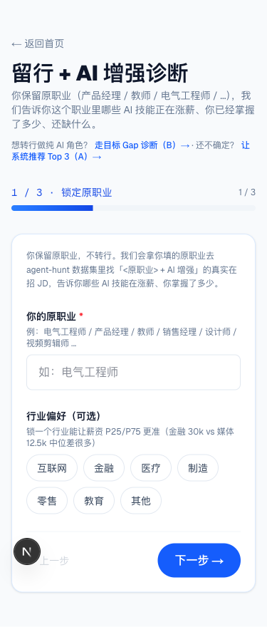

**路径**：首页 C 主 CTA → /diagnose-augment

**头部**：标题"留行 + AI 增强诊断" / 副标题"你保留原职业（产品经理 / 教师 / 电气工程师 / ...），我们告诉你这个职业里哪些 AI 技能正在涨薪、你已掌握多少、还缺什么" / **跨路线引导**："想转行做纯 AI 角色？走目标 Gap 诊断（B）→ · 还不确定？让系统推荐 Top 3（A）→"

**Step 1 / 3 · 锁定原职业** 字段：
- 顶部说明卡："你保留原职业，不转行。我们会拿你填的原职业去 agent-hunt 数据集里找『<原职业> + AI 增强』的真实在招 JD"
- **你的原职业** *（free-text 输入，例：电气工程师 / 产品经理 / 教师 / 销售经理 / 设计师 / 视频剪辑师 …）
  - 用户输入时实时模糊匹配 420 长尾原职业字典
  - 命中后下方显示「数据集匹配（精确/模糊）：{matchedKey} · {N} 条 AI 增强 JD · 中位 ¥Xk」
  - 同义近邻 chips（点击替换）："电气设计师 · M JD" "电气机械 · K JD" ...
- **行业偏好（可选）** chip 单选：互联网 / 金融 / 医疗 / 制造 / 零售 / 教育 / 其他（说明文案：锁一个行业能让薪资 P25/P75 更准）

Step 2 是背景 + 技能（顶部 banner 显示"已锁原职业：{原职业} · {行业}"），Step 3 偏好。

---

## ⑤ 报告页 · 路线 A（提交后秒出）

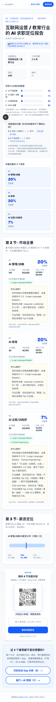

**v0.4 路线 A 报告结构**（自上而下）：

1. **顶栏**：左 ← AIJobFit / 右 复制链接 + 保存分享图按钮
2. **第 1 节 · 封面**
   - 报告 ID（如 `#EYJJDXJY`）+ 标题 `{currentJob}的 AI 求职定位报告` + 生成日期
   - **行业 context badge**（蓝色）：「📊 教育行业 N 条 AI 增强 JD（薪资样本 M）· 其他行业对照见 Section 2」（用户填了行业或 currentJob 推断时显示）
   - 4 个用户基本信息卡（职位 / 年限 / 学历 / 城市）
   - **「你和 4 主线的匹配度」横条图**（A/B/C/D 各占多少 %，每条注 jdCount）
   - **「技能指纹扫描 · 你勾的技能命中了哪些主线？」段**（v0.4 新增 / 关键解释机制）
   - **「你最匹配的 3 个角色」**：Top 3 角色排名 + 匹配度
3. **第 2 节 · 市场全景**：3 张角色卡（每个角色 jdCount / 中位月薪 / P25-P75 / 必备技能 / **「为什么是你？」推理链** —— 列出技能命中、targetTrack 加权、行业匹配/偏移、industry hard filter、主线指纹、0 命中诚实声明等可解释推理）
4. **第 3 节 · 薪资定位**：industry-augmented 切片（教育用户看 ¥14.5k/25k/37.5k）+ 期望薪资达成率（绿/黄/红色带）+ 城市 tier 对照行 + 应届对照行（应届时）
5. **下面 4 节遮罩** —— 用户看到下方那张大 QR + 激活码输入卡 + 跨路线 CTA

整页一屏看下来：信息满满 → 滚到第 4 节就被 QR 遮住，触发"想看完"心理。

---

## ⑥ 报告页 · 路线 B（锁定目标）

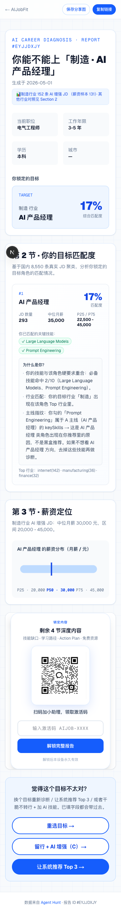

**v0.4 路线 B 报告结构差异**：

1. 第 1 节封面：标题改"AI 求职目标 Gap 诊断" + 行业 context badge + 「**你锁定的目标**」大卡：`TARGET · {industry} 行业 · {roleName}` + 综合匹配度大数字（如 17%）
2. 第 2 节"你的目标匹配度"：**只有 1 个角色卡**（不是 Top 3），含完整 whyMatched 推理链。例如电气工程师 + 制造 + AI 产品经理用例会输出："你的技能 / 该角色要求重叠：必备技能命中 2/10（Large Language Models, Prompt Engineering）· 行业匹配：你的目标行业『制造』出现在该角色 Top 3 行业里 · 主线指纹：你勾的『Prompt Engineering』属于 A 主线（AI 产品经理）的 keySkills · 这条 AI 产品经理岗位线虽然总占比出现在你推荐里的不是最高，但你的 AI 产品经理路径上去掉这些适配差距就够了。"
3. 第 3 节薪资：基于锁定角色 + 行业切片
4. 后 4 节遮罩 + 跨路线 CTA：**「重选目标 →」+ 「留行 + AI 增强（C）→」+ 「让系统推荐 Top 3 →」三选**

**关键 UX**：B 用户进来"自己负责"，所以 0 命中场景不会有黄色 fallback banner，只在 whyMatched 里诚实声明 "0 项命中"。

---

## ⑦ 报告页 · 路线 C（留行 + AI 增强）

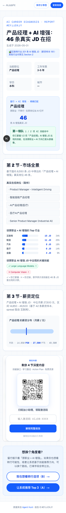

**v0.4 路线 C 报告结构差异**（这是 v0.2 新增、v0.4 仍是核心）：

1. **第 1 节封面**：标题 `{原职业} + AI 增强：N 条真实 JD 在招` + 行业 context badge `📊 互联网行业 X 条 AI 增强 JD（薪资样本 Y）· 其他行业对照见 Section 2`
   - **「留行 + AI 增强 · 精准匹配」大卡**：原职业名 + 描述 "保留这个职业，在原岗位加 AI 杠杆" + 大数字 `46 条 AI 增强真实 JD`
   - **readiness 档位 banner**（emerald 第一梯队 / 黄 中梯 / 红 起步 / 灰 数据不足）：例 "**第一梯队** 1 / 2 项 augmentSkills 命中 · 你已掌握 1/2 项「产品经理」AI 增强 JD 出现的关键技能，在该原职业 + AI 方向已是头部画像"
   - 模糊匹配同义近邻 chips（如果用户原职业 free-text 触发了 fuzzy match）
2. **第 2 节 · 市场全景**（替换为 RouteCOverview）：
   - **真实在招岗位（取样）**5 条 sampleTitles
   - **该原职业 + AI 增强的 Top 行业**横条图（互联网 / 电商 / 汽车 / 医疗 / 金融 占比）
   - **该原职业出现的关键技能**：augmentSkills ✓ 已掌握（绿色 chip）/ ✗ 未掌握（红色 chip）
3. **第 3 节 · 薪资定位**：用「原职业中位 + topIndustries[0] industry slice spread」组合估 P25/P50/P75（如 "产品经理 + AI 增强 JD：中位月薪 27,500 元，区间 14,850 - 49,500（基于 42 条薪资样本，spread 取自互联网）"）
4. 后 4 节遮罩
5. 跨路线 CTA："**我也想看转行选项（B）→** + **让系统推荐 Top 3（A）→**" 二选

---

## ⑧ 软门槛遮罩 · 漏斗的关键转化点

报告滚到第 4 节就开始模糊。遮罩中央是这张卡：

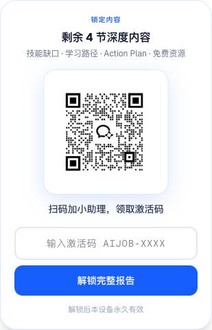

**这一屏要传达 4 件事**：
1. `锁定内容` 标签（蓝字）+ "**剩余 4 节深度内容**"
2. "技能缺口 · 学习路径 · Action Plan · 免费资源" — 具体讲剩下 4 节是什么
3. **小助理 QR**（中间大方块） + 下方文字"扫码加小助理，领取激活码"
4. **激活码输入框**（"输入激活码 AIJOB-XXXX" placeholder）+ 蓝色"解锁完整报告"按钮 + 灰字"解锁后本设备永久有效"

**关键操作（你要懂）**：
- 用户在微信里**长按 QR 图片** → 微信弹"识别图中二维码"菜单 → 跳到加好友确认页
- 用户加好友请求 → 你通过 → **你回复激活码 `AIJOB-2026`**（详细话术见运营手册场景 1）
- 用户回报告页 → 输入激活码 → 看到后 4 节

---

## ⑨ 用户输入激活码

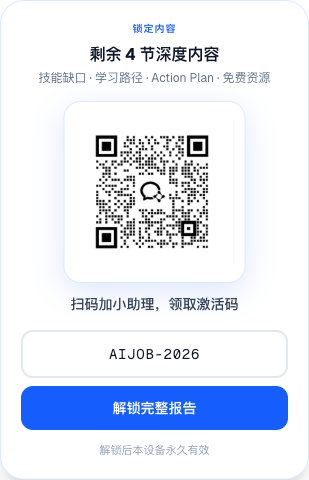

**容错说明（用户可能问）**：
- **大小写不敏感**：输 `aijob-2026` 也行
- **前后空格自动 trim**：复制粘贴带空格也没事
- **解锁后本设备永久有效**（写在按钮下方）— 同一台手机/电脑下次打开同一份报告不需要再输码
- **换设备需要重新输码**（激活码同一个，长期不变）

---

## ⑩ 解锁后的后 4 节

输完点"解锁完整报告"，遮罩瞬间消失，后 4 节平滑出现。完整解锁版本（4 节都展开）长这样：

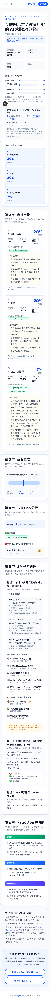

下面分节看每一节内容。

### 第 4 节 · 技能 Gap 分析

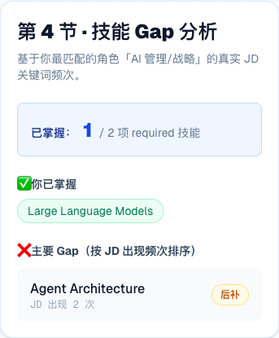

- "已掌握 X / N 项 required 技能"用大数字给冲击
- 已掌握的技能用绿色 ✅ chip
- 主要 Gap 用红色 ❌，按 JD 出现频次倒序
- 每个 Gap 标"**先补 / 后补 / 优选**"优先级

**用户常见反应**："原来我离这个角色就差这几样"

**路线 C 留行版差异**：Gap 节展示 augmentSkills 命中度 + 缺的 augmentSkills（每项标 high 优先级，因为 augmentSkills 本就是该原职业 AI 增强 JD 必出现的高价值技能）

### 第 5 节 · 3 种学习路径

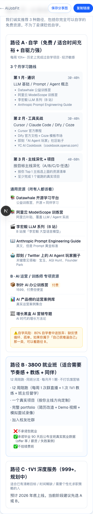

- **路径 A · 自学（免费 / 适合时间充裕 + 自驱力强）**：3 个月学习路线（第 1 月通识 / 第 2 月工具实战 / 第 3 月主线深化 + 项目）+ 通用资源（Datawhale / 阿里云 ModelScope / 李宏毅 LLM / Anthropic Prompt Engineering Guide / 即刻 Twitter AI Agent 玩家圈子）+ 主线专项资源（按 A/B/C/D/E 切换）
- 自学路径下方有 **黄色警示卡**："⚠️ 自学风险：80% 自学者中途放弃；缺反馈循环、孤单。如果你属于"自己很难逼自己"那一类，可以看路径 B"
- **路径 B · 3800 就业班（适合需要节奏感 + 教练 + 同伴）**：12 周陪跑 + 1V1 教练 + 班主任督学 + 1 个真实项目 + 完整 portfolio + 校友社群。**承诺**：❌ 不承诺包就业 / ✅ 90 天后公开全班真实就业数据 / ✅ 不持续招生
- **路径 C · 1V1 深度服务（999+，规划中）**：标"规划中，2026 年底上线，建议先选 A 或 B"

**这是诚实推免费资源 + 同时给商业化路径留口子的设计**。

### 第 6 节 · 7 / 30 / 90 天行动

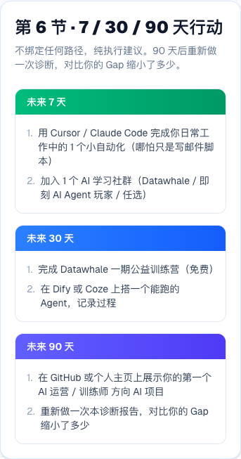

3 个时间盒（绿/蓝/紫色 banner）：
- **未来 7 天** — 用 Cursor / Claude Code 完成 1 个小自动化（写邮件脚本即可）+ 加 1 个 AI 学习社群（Datawhale / 即刻）
- **未来 30 天** — 完成 Datawhale 一期公益训练营 + 在 Dify 或 Coze 上搭一个能跑的 Agent
- **未来 90 天** — GitHub 或个人主页展示项目 + 重新做诊断对比 Gap 缩了多少

**重新做诊断**这个动作是产品的留存钩子。

**应届生用户的差异**：d7 加 AI 校招/实习社群，d30 投出第一份实习/校招简历，d90 拿 1 段实习经验或 1 个能演示项目，路径 A/B 副标题也变成"应届校招前的黄金窗口"和"应届秋招/春招冲刺最佳节奏"。

**路线 C 留行用户的差异**：d7 锁定 1 个 AI 工具 + 把当前工作 1 个重复任务用 AI 改造；d30 用工具在 topIndustry 场景做小自动化能演示给同事/上级；d90 把 30 天的 AI 改造写进简历 + 内部述职/周报，让公司看到 AI 杠杆。

### 第 7 节 · 报告生成依据

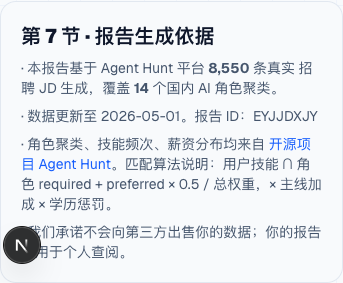

末节是数据透明度声明：JD 总数 / 角色聚类数 / 数据更新日期 / 报告 ID / 算法说明（用户技能 ∩ 角色 required + preferred × 0.5 / 总权重，× 主线加成 × 学历惩罚）/ 不出售用户数据承诺 + Agent Hunt 链接

**用户质疑结论时**，把他指到第 7 节让他看数据来源 + 报告 ID。

### 报告底部 · 三路线互通 CTA

报告页 LockedSections 之后还有一个**互推 CTA section**（在上面的 05/06/07 全页截图最下方）：

- **路线 A 报告底部**：「这 3 个推荐都不是你想要的？」+ 两个按钮：「切到目标 Gap 诊断（B）→」+ 「留行 + AI 增强（C）→」
- **路线 B 报告底部**：「觉得这个目标不太对？」+ 三个按钮：「重选目标 →」+「留行 + AI 增强（C）→」+「让系统推荐 Top 3 →」
- **路线 C 报告底部**：「想换个角度看？」+ 两个按钮：「我也想看转行选项（B）→」+「让系统推荐 Top 3（A）→」

所有跨路线 CTA 都带 `?from=<hash>` 自动预填用户已经填过的字段，零摩擦切换。

---

## 站外进站路径 · GEO / SEO 矩阵（v0.4.0 现状）

不是所有用户都从微信海报扫码进。GEO 二期 ship 后站点有约 **228 个 SSG 静态页面 + RSS feed**，搜索引擎和 AI 答案引擎也是流量源。

```
搜索引擎 / AI 答案引擎（ChatGPT / Perplexity / 豆包）/ 微信文章 / 朋友圈
   │  搜「AI 产品经理转行」「教师转 AI」「电气工程师 + AI」「AI 产品经理 vs 数据分析师」...
   ▼
SEO/GEO 落地页（约 228 个）
   ├─ /role/[id]                   14 个角色画像（如 /role/product_manager）
   ├─ /industry/[id]               12 个行业切片（如 /industry/education）
   ├─ /industry/[id]/[role]        65 个二维切片（如 /industry/education/product_manager）
   ├─ /city/[tier]/[role]          25 个城市×角色（如 /city/new-tier-1/operations）
   ├─ /compare/[a]-vs-[b]          91 个角色对比（如 /compare/product_manager-vs-data）
   ├─ /skills                      35 技能 × 14 角色命中热力图（SVG SSR · 见下图）
   ├─ /blog                        9 篇 blog 列表
   ├─ /blog/[slug]                 9 篇 blog 全文
   └─ /blog/feed.xml               RSS 2.0 feed
   │   每页都有 JSON-LD 结构化数据 + 顶部/底部 "开始诊断" CTA
   ▼
首页 → 路线选择（B / C / A）→ 进入诊断主漏斗
```

### `/skills` 35 技能 × 14 角色热力图（v0.4 新增）

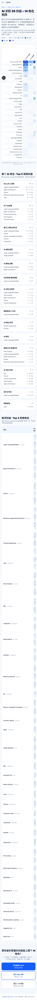

**这是什么**：35 项 AI 通用技能（Python / LLM / Prompt Engineering / RAG / LangChain / Pytorch / Computer Vision / Stable Diffusion / Cursor / Coze / Dify / 飞书多维表格 ...）× 14 个 AI 角色聚类的命中率矩阵。每个 cell 颜色越深表示该技能在该角色 JD 里出现频次越高。下方还有"反向查表"区块：每角色的 top 5 技能 / 每技能的 top 3 角色。

**纯 SVG SSR 渲染（无 client JS）**，928×1120 矩阵，cell 链接到 `/role/[id]?skill=[id]`。

**用户能拿它干嘛**：
- 想转某个角色 → 看那行哪几个技能频次最高 → 优先补
- 已经会某个技能（比如 Cursor）→ 看那列出现在哪些角色里 → 找匹配的方向

### 用户可能问什么 / 你怎么答

- **"我搜 XX 看到你们的 [角色介绍 / blog / 技能图]，怎么做诊断？"** → 「页面顶部和底部都有『开始诊断』按钮，点进去填表 3 分钟就能拿报告」
- **"为什么有的页面没有诊断表单？"** → 「那是数据洞察页（角色画像 / 行业切片 / 技能热力图等），让你了解市场全景。诊断表单在 `/diagnose` `/diagnose-target` `/diagnose-augment` 这三条路线，点页面 CTA 就能进」
- **"我能订阅你们的更新吗？"** → 「有 RSS feed `/blog/feed.xml`，主流 RSS 阅读器都能订。也可以加我微信，新的 blog 我会同步」
- **"AI 引擎（ChatGPT / Perplexity / 豆包）能搜到你们吗？"** → 「我们做了完整的 JSON-LD 结构化数据 + HowTo schema + llms.txt，AI 引擎是抓得到的。被引用频次还在 soak 期，每月跑一次复检」

**业务实操**：写小红书/公众号/知乎引流文案时，**直接挂这些 SSG 页面也行**（不一定要回首页），因为每个 SSG 页面底部都有诊断 CTA + 加微信入口。比如写「教师转 AI 全国 130 条 JD 拆解」可以挂 `/industry/education` 或 `/blog/teacher-to-ai`，让搜索流量也走漏斗。

---

## 微信生态特有行为（PC 浏览器看不到的）

### A. 长按 QR 自动识别
用户在微信 WebView 里**长按小助理 QR 图片** → 微信弹"识别图中二维码"菜单 → 一步加好友。这是微信的原生能力，不需要扫码。

### B. "复制链接" 在微信里降级显示
报告页顶部有"复制链接"按钮。在微信 WebView 里它会**降级为提示文字**："点右上角 ··· 复制链接"。原因：微信 WebView 屏蔽了 navigator.clipboard API，只能引导用户走微信原生的菜单。

### C. 分享卡片（动态 OG）
用户把报告链接发到聊天/朋友圈时，微信会自动抓取 OG 图：
- **聊天卡片**（800×800 方形）— 自动展示 Top 1 角色 + 匹配度 + 薪资
- **朋友圈卡片**（横版 1200×630）— 同上

OG 图是 server-side 动态生成的，每个用户的分享卡片不一样，按 route 自动切版式。SSG 落地页（/role / /industry / /skills / /blog）也都有动态 OG 图。

### D. "保存分享图" 1080×1920 海报
报告页右上角"保存分享图"按钮 — 生成竖版海报（适合发朋友圈截图）。海报底部有 QR 直接指向首页（不是你的小助理 QR）— 让海报在朋友圈传播时能引来更多新用户。

---

## 运营动作清单

| 流程节点 | 用户动作 | 你的动作 |
|---|---|---|
| ①-④ | 看首页 → 填表 → 提交 | 不接触 |
| ⑤ | 看前 3 节报告 | 不接触 |
| ⑥ | 长按 QR 加好友 | **接到加好友请求 → 通过** |
| ⑥-⑦ | 等你回复 | **发欢迎语 + 激活码（见运营手册场景 1）** |
| ⑦ | 输入激活码解锁 | 等用户消化 5-10 分钟 |
| ⑧ | 看完后 4 节 | **发第二条：问 Top 1 角色 / 走的哪条路线（B 转行 / C 留行 / A 兜底）/ 感兴趣哪条路径** |
| 后续 | 用户回应或沉默 | **按回应 + 路线分流（社群 / 1V1 / 不主动催）** |

具体话术 / 激活码错输处理 / 0 匹配度用户怎么答 / 留行用户档位差异化话术 / 用户问"是不是要付费" / 用户问"我会剪映就推 AIGC 是黑盒？" → 全在 [`产品手册-运营版.md`](./产品手册-运营版.md) 里。

---

## 上线前自测清单

发内容引流之前，你应该能不假思索答出：

- [ ] 激活码是什么？答：`AIJOB-2026`，大小写不敏感
- [ ] 用户加你之后第一句话怎么说？答：见运营手册场景 1 模板
- [ ] 用户匹配度 0% / readiness 数据不足怎么办？答：见运营手册场景 4
- [ ] 用户问"是不是要付钱"？答：永久免费，激活码只是加微信的触点
- [ ] 用户长按 QR 没反应？答：让他升级微信版本，或者直接发链接 + 激活码给他
- [ ] 用户在微信里点"复制链接" 没反应？答：让他点屏幕右上角 ··· 菜单，里面有"复制链接"
- [ ] 用户问数据从哪来？答：开源项目 Agent Hunt，5673 已聚类 / 8238 总 JD（runtime 拉最新），链接在报告第 7 节末
- [ ] 路线 A/B/C 啥区别？答：A 是系统推 Top 3 角色（用户没目标），B 是用户锁定行业 + 14 角色之一算转行匹配率（用户要转行），C 是用户填原职业看「原职业 + AI 增强」（用户不转行只想加 AI 技能）。三个互推都自动带预填，用户来回切换无成本
- [ ] 应届生流量怎么处理？答：表单工作年限有 3 个应届分支；Cover/Roles/Salary 自动注入校招 vs 社招对照 + 应届主战场城市；7/30/90 天 Action 自动切到校招/实习语境；话术上重点推免费自学（路径 A）+ 鼓励先做 1 个能演示的项目，别推 1V1（999+）
- [ ] 用户问"我会剪映就推 AIGC？是不是黑盒"？答：报告 Cover 有「主线指纹扫描」段，明确告诉他「你勾的剪映/SD 命中 D 主线 keySkills 3/5，所以 D 类角色出现在 Top 3」。机制透明，不是黑盒
- [ ] 用户走了路线 C 但 readiness "数据不足"（如电气工程师 1 条 JD）？答：见运营手册场景 4 第二段，引导他看 sampleTitles + topIndustries 判断方向，或切 Route B 看转行 Gap 对照
- [ ] 用户从搜索引擎/AI 引擎搜到 SEO 落地页（不是首页）进来怎么办？答：所有 SSG 页面底部都有"开始诊断"CTA，让他点进去填表。SEO 落地页本身就是漏斗的一部分
- [ ] 用户问"你们 blog 怎么订阅"？答：RSS feed 在 `/blog/feed.xml`，或者加我微信新文章我同步
- [ ] 用户进的是 `/skills` 热力图，没看到诊断表单？答：那是数据洞察页，让用户看 35 项 AI 技能在 14 个角色里的命中率。点页面顶部"开始诊断"或底部 CTA 进诊断流程

---

## 常用资源链接

- 生产：<https://aijobfit.llmxfactor.cloud>
- 运营手册：[`产品手册-运营版.md`](./产品手册-运营版.md)
- Blog 列表：<https://aijobfit.llmxfactor.cloud/blog>
- 技能热力图：<https://aijobfit.llmxfactor.cloud/skills>
- RSS feed：<https://aijobfit.llmxfactor.cloud/blog/feed.xml>
- 数据来源：<https://github.com/LLM-X-Factorer/agent-hunt>
- 一份示例报告（可拿来给同事演示）：<https://aijobfit.llmxfactor.cloud/result/eyJjdXJyZW50Sm9iIjoi5LqS6IGU572R6L-Q6JClIC8g5pWZ6IKy6KGM5LiaIiwieWVhcnNFeHAiOiIzLTUg5bm0IiwiZWR1Y2F0aW9uIjoi5pys56eRIiwic2tpbGxzIjpbIlByb21wdCBFbmdpbmVlcmluZyIsIkNoYXRHUFQiLCLlhoXlrrnov5DokKUiLCLnlKjmiLflop7plb8iXSwidGFyZ2V0VHJhY2siOlsiQiDCtyBBSSDov5DokKUgLyDorq3nu4PluIgiXSwibW90aXZhdGlvbiI6IjM1IOWygeWNseacuiIsImluZHVzdHJ5IjpbIuaVmeiCsiJdLCJ0aW1lQnVkZ2V0IjoiMTAtMjAg5bCP5pe2In0>
